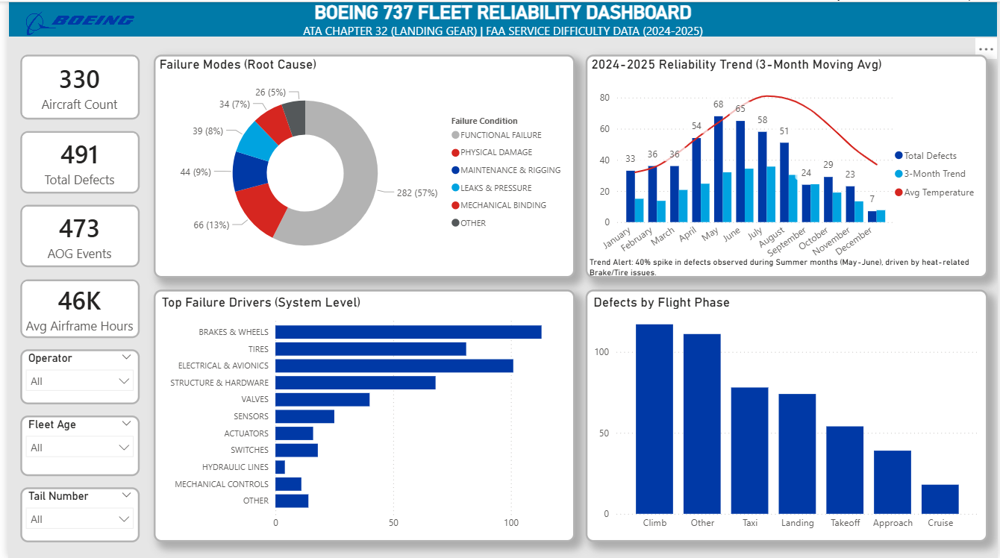

# ✈️ Boeing 737 Fleet Reliability Dashboard 

[Click here for app link](https://app.powerbi.com/view?r=eyJrIjoiMTE5MTQ0OTktNThjOS00NTRiLWE2MmMtYjZmYzNkZjZiMDczIiwidCI6ImRjNDliNmQyLTM1ZDQtNDM2Yi04Mzg4LWY1MThkOGRjYzNiZCJ9))

## 📌 Project Overview
**Business Problem:** Airlines face costly delays due to "Unscheduled Maintenance." The goal of this project was to analyze 500+ FAA Service Difficulty Reports (SDR) to determine which sub-systems of the Landing Gear (ATA Chapter 32) drive the most downtime.

**The Solution:** I engineered an end-to-end data pipeline to ingest raw unstructured text data from the FAA, normalize component names, and visualize reliability trends to drive preventative maintenance strategies.

---

## 🔍 Key Findings
1.  **Sensor Failures:** 57% of defects are functional/avionics issues (low repair cost, high disruption), specifically Proximity Sensors and Switches.
2.  **Seasonality:** Brakes & Tires show a **40% failure spike** in Summer months, correlating strongly with ambient temperature rise (Heat Soak).
3.  **Operational Impact:** **96%** of reported defects resulted in **AOG (Aircraft on Ground)** status, with only 4% eligible for deferral (MEL).
4.  **Phase Analysis:** The highest volume of defects occurs during **Climb**, pointing to Retraction Actuator stress rather than Landing impact.

---

## 🛠️ Technical Workflow

### 1. Data Engineering (SQL)
* **Ingestion:** Loaded raw FAA CSV data into a local **MySQL** database.
* **Cleaning:** Handled data type inconsistencies (Text vs Int) and Null values in flight hours.
* **Logic:** Created a schema to handle 1-to-Many relationships between aircraft tail numbers and failure events.

### 2. Data Modeling (Power BI)
* **Star Schema:** Built a data model connecting the Fact Table (Defects) to Dimension Tables (Date, Temperature).
* **DAX Measures:**
    * `3-Month Moving Average` to smooth volatility.
    * `AOG Events` calculated based on non-deferred status.
    * `Risk Index` calculated by weighting failure modes (Fire = 10, Leak = 5).

### 3. Visualization
* Designed a grid-layout dashboard mimicking internal aviation software tools.
* Implemented **Drill-Through** functionality to audit specific aircraft defect logs.
* Used **Tooltips** to reveal operational details (Deferral status) without cluttering the main view.

---

## 📂 Project Structure
* `00_Raw_Data`: Source data file (`FAA_SDR_Boeing737_ATA32_2024_2025.xlsx`).
* `01_SQL_Scripts`: Raw SQL queries used for data cleaning.
* `02_PowerBI`: The `.pbix` file containing the dashboard and data model.
* `03_Case_Study_Report`: A comprehensive PDF report detailing the business logic and insights.
* `04_Screenshots`: Images used in this README.

---

## 📸 Operational Views

### The Data Model (Star Schema)

### Drill-Through Detail (Defect Log)

### Tooltip Interaction (Defect Deferral)

### Temperature Trend Analysis

---

### 📬 Contact
* **LinkedIn:** [Momin Khan](https://www.linkedin.com/in/mominpathann/)
* **Portfolio:** [Boeing 737 Fleet Reliability](https://github.com/MominPathann/Boeing-737-Fleet-Reliability)

